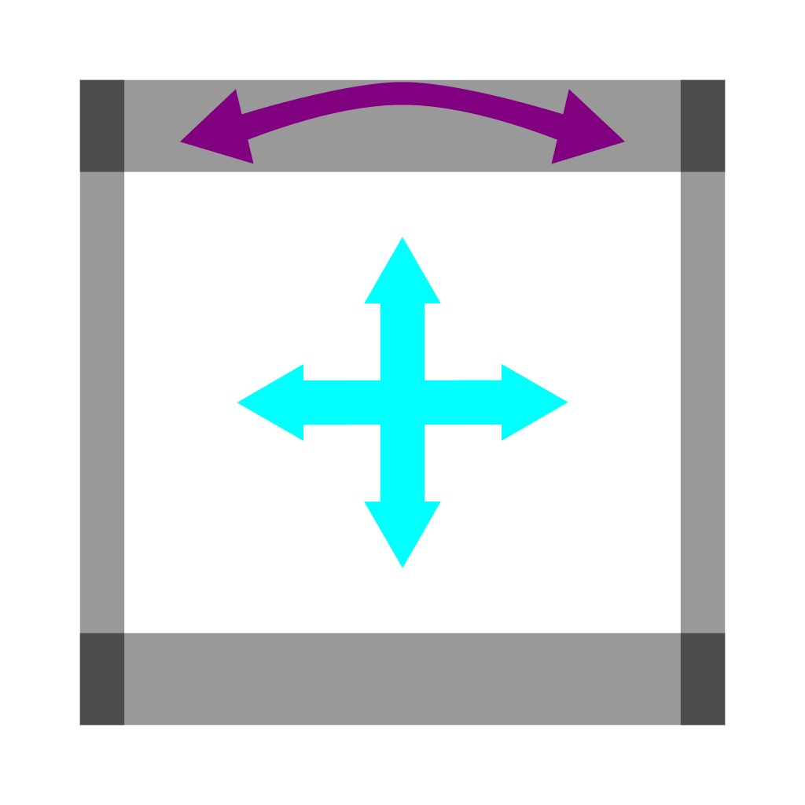

## Swerve From an Overview

Swerve is a little complex at first, but to implement it takes a lot of thinking 
(trust me, I'll try to make it easy, so you don't have to have a few existential crisis as you program it for the sixth time)

Sweve drive has to start with the basics: you have 4 wheels. The first thing you need to do is understand how they work.

Each of you for wheels has some manner that they need to go to push your robot, and there are *2* different factors that show how they work. These are:

- **Speed** - How fast you want your wheel to go. This is a number between 0 and 1, where 0 is not moving at all and 1 is maximum speed.
- **Heading** - The direction the wheel needs to go.


Heading: the angle that something is facing. It's important because it is key to direction. Think of it as the angle something is at.


Each wheel needs to go somewhere when we want the robot to move so we need to look at how we control the robot.

## Controlling the Robot

We use a controller to tell the robot where to go. The first thing we need to do is understand how swerve control works. 

Our controllers have two joysticks that can be used to control the robot.

Note that the joystick with the blue arrows has them pointing in all directions. This represents where you want the robot to go to.
The other joystick is for controlling the heading of the robot.


The joystick with the blue is on the left and controlls the position of the robot. Swerve enables the robot to go in any direction, 
including sideways and forward, like a drone or helicopter.


The purple arrows represent the manner that a person would want to turn the robot.

The control systems are intuitive and the robot's positioning should look like this:

Next we'll look at breaking the overall breakdown of swerve.