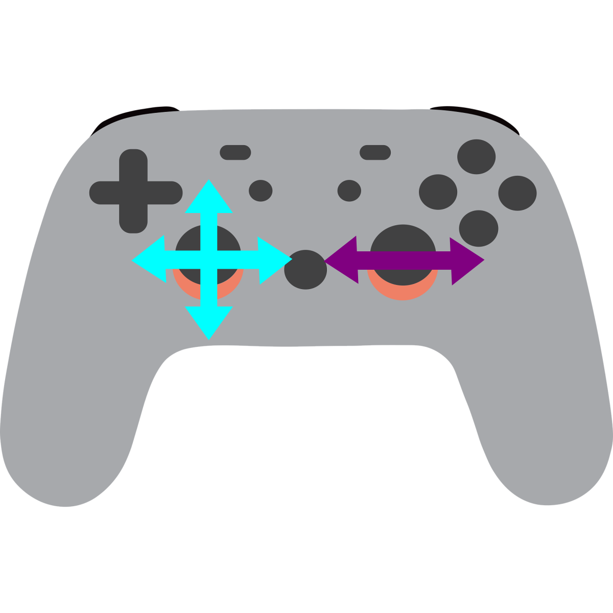

# Swerve Math

## Swerve Controller Setup


Remember the controller?



Well, these value are incredibly important when programming swerve. We went over what values should translate to what in swerve, but grabbing these values is key and is something that we should note.

## Swerve Preliminary Steps


The first steps of swerve involve grabbing the values from your controller and using them to be able to put them into your program

The first thing it go grab the x and y from the controller.

In the beginning of the declaration of your code you should put
```java
  public static XboxController controller = new XboxController(0);
```

The controller's state for x and y can be grabbed using the

```java
        int x =  controller.getLeftX();
        int y = -controller.getLeftY();
```

To start with this I reccomend putting