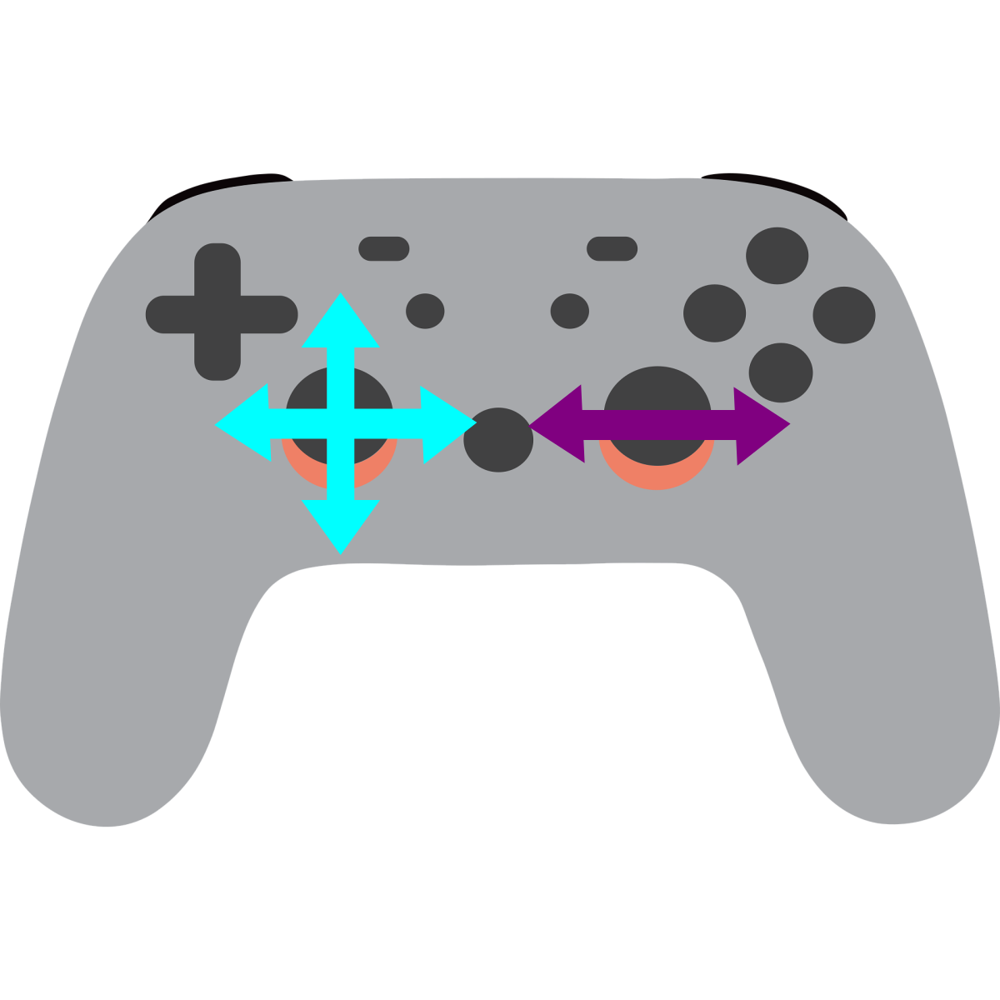

# Swerve From a Mathematical Perspective

## Sweve Controller Setup

Remember the controller?

Well, these value are incredibly important when programming sweve. We went over what values should translate to what in swerve, but grabbing these values is key and is something that we should note.

### Programming Setup

To set up your programming environment you need to download the [wpilib suite](https://github.com/wpilibsuite/allwpilib/releases/latest) from GitHub, and if you need, you can look through the [official website dowload](https://docs.wpilib.org/en/stable/docs/zero-to-robot/step-2/wpilib-setup.html) (which redirects to the previous link) that gives a bit more info if you encounter problems.

### Project Setup

Once you have the stuff installed and are ready to Program Sweve!!!

You should be able to [make a new project](https://docs.wpilib.org/en/latest/docs/zero-to-robot/step-4/creating-test-drivetrain-program-cpp-java-python.html#create-java-cpp-project) and select `template` then `java` then `Timed Robot` (don't select the advanced one).

You should have put the project in a folder (like Documents) and put in a team number (just put our team number, 9777 if you don't have a team number yet,
it's not too important for simple development).

The code now should now be generated and in the left pane you should see this in the side pane:

![[ExampleCodeStartup.png]]

As you can see, I have named the project `ExampleSwerveDrive`. 

We will start programming everything on the next page!!!

