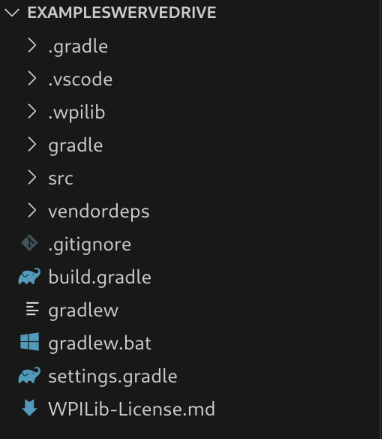
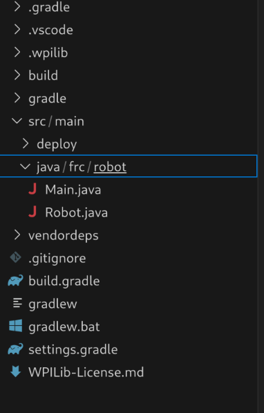
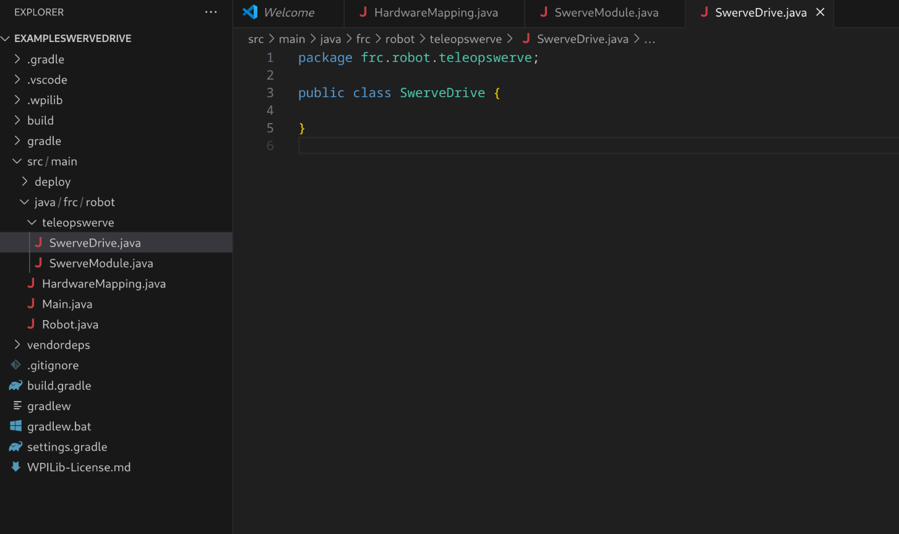

### Programming Setup

To set up your programming environment you need to download the [wpilib suite](https://github.com/wpilibsuite/allwpilib/releases/latest) from GitHub, and if you need, you can look through the [official website download](https://docs.wpilib.org/en/stable/docs/zero-to-robot/step-2/wpilib-setup.html) (which redirects to the previous link) that gives a bit more info if you encounter problems.

### Project Setup

Once you have the stuff installed and are ready to Program Swerve!!!

You should be able to [make a new project](https://docs.wpilib.org/en/latest/docs/zero-to-robot/step-4/creating-test-drivetrain-program-cpp-java-python.html#create-java-cpp-project) and select `template` then `java` then `Timed Robot` (don't select the advanced one).

You should have put the project in a folder (like Documents) and put in a team number (just put our team number, 9777 if you don't have a team number yet,
it's not too important for simple development).

The code now should now be generated and in the left pane you should see this in the side pane:

As you can see, I have named the project `ExampleSwerveDrive`. 

Your code is located inside the `src/main/java/frc/robot` folder

## Setup for This Tutorial

One should make three new files, and one new folder.

1. Right click on the `src/main/java/frc/robot` and click new file. When a text box appears, type in `HardwareMappings.java`. (Don't worry about the text that appears for the file)
2. Right click on the `src/main/java/frc/robot` and click the new folder and name it `teleopswerve`.
3. Right click on the `src/main/java/frc/robot/teleopswerve` folder and make 2 new files (like in step 1) named `SwerveModule.java` and `SwerveDrive.java`.
4. Now you're done making all the files you'll need. The only thing left is the hit *Ctrl+S*
for all the rest of the files.

You're setup should look like something like this.


The white dot next to the filename in the editor means that the file is not saved, you can just select the file, and once it loads in the 
exitor, you can type _*Ctrl+S*_ to save it

